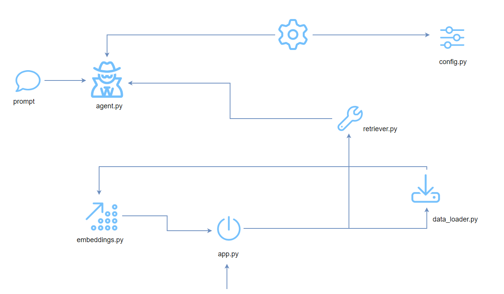

# Lets_Build_Agentic_RAG_From_Scratch
Agentic RAG (Agent-based Retrieval-Augmented Generation) is an advanced framework for question answering that enhances traditional methods by incorporating intelligent agents. These agents are designed to tackle complex questions through intricate planning, multi-step reasoning.

## Introduction

Full Article : [https://medium.com/@learn-simplified/lets-build-multi-agent-rag-from-scratch-6ce61c295111

Coordinating Agents to Retrieve, Process, and Deliver Data Efficiently

## What's This Project About?
This article is all about building a Multi Agent Retrieval-Augmented Generation (RAG) system from the ground up. Think of it as creating a team of AI assistants that work together to answer complex questions. We'll walk through the process of setting up a knowledge base, teaching our AI how to understand and search through this information, and then use it to generate smart, context-aware answers. 
It's like we're building a bridge between vast amounts of data and human-like understanding. We'll cover everything from loading documents, creating embeddings (that's AI-speak for turning words into numbers the computer can understand), setting up a vector store (imagine a super-efficient filing cabinet for our AI), and finally, bringing it all together with an AI agent that can think, retrieve, and respond.

## Why Use This Project?
In today's fast-paced business world, information is king. But with the sheer volume of data out there, finding the right information quickly can be like searching for a needle in a haystack. That's where AI comes in, and that's why this article is so important. Through the lens of a fictional company, we'll show you how to implement a system that can revolutionize how businesses handle information and make decisions. 
Imagine having an AI assistant that can instantly pull relevant information from your company's entire knowledge base and use it to answer complex questions or solve problems. It's not just about finding information faster; it's about making smarter, more informed decisions. Whether you're in tech, finance, healthcare, or any other industry, understanding and implementing these AI techniques can give your business a significant competitive edge.

## Architecture



# Tutorial: Lets Build Agentic RAG From Scratch

## Prerequisites
- Python installed on your system.
- A basic understanding of virtual environments and command-line tools.

## Steps

1. **Virtual Environment Setup:**
   - Create a dedicated virtual environment for our project:
   
     ```bash
     python -m venv Lets_Build_Agentic_RAG_From_Scratch
     ```
   - Activate the environment:
   
     - Windows:
       ```bash
       Lets_Build_Agentic_RAG_From_Scratch\Scripts\activate
       ```
     - Unix/macOS:
       ```bash
       source Lets_Build_Agentic_RAG_From_Scratch/bin/activate
       ```

2. **Install Project Dependencies:**

   - Navigate to your project directory and install required packages using `pip`:
   
     ```bash
        
     cd path/to/your/project
     pip install -r requirements.txt
     ```

3. **Run - Agentic RAG**


   ```bash 
   # Run Agentic and Standard RAG 
   python app.py
   
   ```


